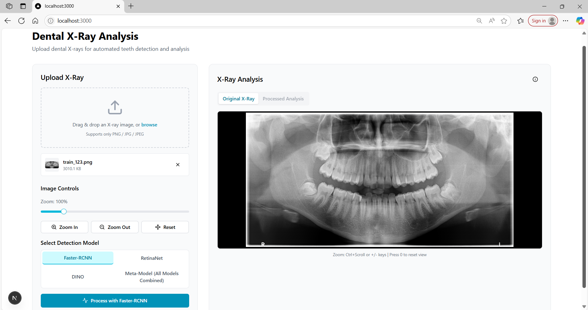
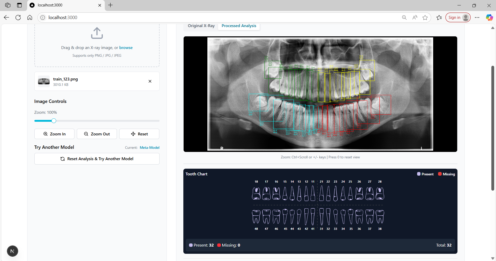

# TEETH DETECTION AND ENUMERATION ON 2D PANORAMIC X-RAYS USING ENSEMBLE METHODS

## Bachelor Thesis Project

This project focuses on the development and evaluation of an automated system for detecting and enumerating teeth in 2D panoramic dental X-rays using ensemble methods. The research involves the implementation, training, and evaluation of three state-of-the-art object detection models:

- Faster R-CNN
- DINO (DETR with Improved deNoising anchOr boxes)
- RetinaNet

## Project Overview

The main objective of this thesis is to create a robust and accurate system for automated teeth detection in panoramic dental radiographs. This involves:

1. Training and fine-tuning three different object detection models
2. Evaluating their individual performance
3. Implementing ensemble methods to combine their predictions (Weighted boxes fusion)
4. Assessing the overall system's accuracy and reliability

## Web Application (Next.js Frontend)

We have also developed a modern web application using **Next.js** to provide an intuitive interface for dental X-ray analysis. The application allows users to:

- **Drag and drop** dental X-ray images (supports PNG, JPG, JPEG)
- **Select from multiple detection models** (Faster R-CNN, RetinaNet, DINO, or a Meta-Model ensemble)
- **Visualize predictions**: View detected teeth with bounding boxes overlaid on the X-ray
- **Switch between original and processed images**
- **See a tooth chart** summarizing present and missing teeth

### User Interface

Below are screenshots of the application in action:

#### 1. Uploading an X-ray and selecting a detection model

#### 2. Viewing processed analysis with bounding boxes and tooth chart

## Technical Details

The project implements and compares three prominent object detection architectures, each representing a different category and era in the evolution of object detection models:

- **Faster R-CNN**: A two-stage detector that combines region proposal networks with Fast R-CNN, representing the traditional CNN-based approach
- **RetinaNet**: A single-stage detector that uses focal loss to address class imbalance, representing the efficient single-stage detection approach
- **DINO**: A transformer-based detector that leverages improved denoising anchor boxes, representing the modern transformer-based architectures that have revolutionized computer vision

The selection of these models was deliberate to study how different architectural paradigms perform on our specific use case of dental X-ray analysis. By comparing models from different categories and time periods, we can:
- Understand the evolution of object detection architectures
- Evaluate which architectural approach works best for dental X-ray analysis
- Identify the strengths and weaknesses of each approach in our specific domain
- Determine the optimal ensemble combination for our use case

## Requirements

A dedicated conda environment was created for this project with the following main packages and versions:

- Python: 3.10.14
- PyTorch: 2.5.1
- CUDA: 12.4
 - see requirements.txt in the 'stuff' folder
## Installation
 - see instructions.sh and commands.sh

### Evaluation Results

| **Model**                            | **mAP**  | **mAP50** | **mAP75** | **mAR**  | **Weights**           | **IoU** |
|-------------------------------------|---------:|----------:|----------:|---------:|-----------------------|--------:|
| Faster R-CNN                        | 0.4817   | 0.9234    | 0.4444    | 0.5842   | -                     | -       |
| RetinaNet                           | 0.4948   | 0.9120    | 0.4851    | 0.6110   | -                     | -       |
| DINO                                | 0.4277   | 0.8269    | 0.3793    | 0.5972   | -                     | -       |
| Faster R-CNN + RetinaNet            | 0.5144   | 0.9349    | **0.5160**| 0.6250   | [1.15, 2]             | 0.6     |
| Faster R-CNN + DINO                 | 0.5111   | 0.9410    | 0.4978    | 0.6266   | [1.25, 1.65]          | 0.65    |
| RetinaNet + DINO                    | 0.5088   | 0.9322    | 0.4954    | 0.6295   | [1.25, 1.65]          | 0.65    |
| Faster R-CNN + RetinaNet + DINO     | **0.5206**| **0.9419**| 0.5150    | **0.6417**| [1.2, 1.05, 1.6]      | 0.65    |

**Table:** Evaluation results for individual models and their combinations using Weighted Boxes Fusion.

## Author

Ciobanu Sergiu-Tudor 
